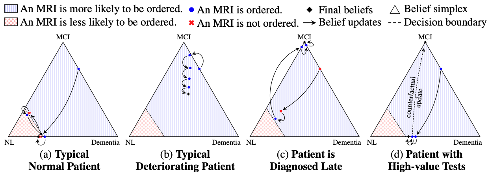

# [Interpretable Policy Learning](https://openreview.net/forum?id=unI5ucw_Jk)

### Alihan H&uuml;y&uuml;k, Daniel Jarrett, Mihaela van der Schaar

#### International Conference on Learning Representations (ICLR) 2021

Code Author: Alihan H&uuml;y&uuml;k (ah2075@cam.ac.uk)

### Overview

This repository contains the necessary code to replicate the main experimental results in the ICLR 2021 paper "[Explaining by Imitating: Understanding Decision by Interpretable Policy Learning](https://openreview.net/forum?id=unI5ucw_Jk)." Our proposed method, *Interpole*, is implemented in files `adni/main-interpole.py` and `diag-bias/main-interpole.py` for the decision environments considered in the paper, namely ADNI, DIAG, and BIAS.



### Usage

First, install *pomdp-solve v5.4* inside the empty directory `pomdp/` by following the instructions on [pomdp.org](https://www.pomdp.org/code/index.html). Make sure the executable `pomdp-solve` is located at `pomdp/src/pomdp-solve`.

Install the required python packages as well by running:

```
python3 -m pip install -r requirements.txt
```

Then, the experiments in the paper can be replicated by running:

```
./adni/run.sh            # generates the results for ADNI given in Table 2
./diag-bias/run.sh       # generates the results for DIAG given in Table 3
./diag-bias/run-bias.sh  # generates the results for BIAS given in Table 4
```

Note that, in order to run the experiments for ADNI, you need to get access to the [Alzheimer's Disease Neuroimaging Initiative (ADNI)](http://adni.loni.usc.edu/) dataset.

### Dependencies

The following packages are needed for running the model:

- dill==0.3.2
- jax==0.1.75
- jaxlib==0.1.52
- numpy==1.19
- pandas==1.0.5
- scikit-learn==0.23.1
- scipy==1.5.1

### Reference

If you use this code, please cite:

```
@article{huyuk2021explaining,
  title = {Explaining by Imitating: Understanding Decisions by Interpretable Policy Learning},
  author = {H{\"u}y{\"u}k, Alihan and Jarrett, Daniel and Tekin, Cem and van der Schaar, Mihaela},
  journal = {International Conference on Learning Representations},
  year = {2021},
}
```